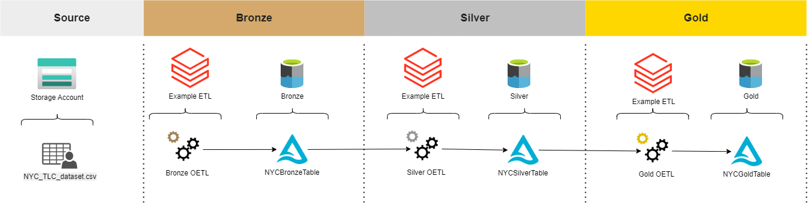

# spetlr-lakehouse-template

## Source

### NYC Taxi & Limousine Commission - yellow taxi trip records

In the spetlr lakehouse template storage account, a copy of the NYC TLC dataset in uploadet. A smaller version of the file is located in `/data` folder.

*"The yellow taxi trip records include fields capturing pick-up and drop-off dates/times, pick-up and drop-off locations, trip distances, itemized fares, rate types, payment types, and driver-reported passenger counts."* - [learn.microsoft.com](https://learn.microsoft.com/en-us/azure/open-datasets/dataset-taxi-yellow?tabs=azureml-opendatasets)

[Link to original dataset location](https://www.nyc.gov/site/tlc/about/tlc-trip-record-data.page)

## Bronze
The table structures in this layer correspond to the source system table structures "as-is". Saved as a delta table.

| vendorID | tpepPickupDateTime    | tpepDropoffDateTime  | passengerCount | tripDistance | puLocationId | doLocationId | rateCodeId | storeAndFwdFlag | paymentType | fareAmount | extra | mtaTax | improvementSurcharge | tipAmount | tollsAmount | totalAmount |
|----------|-----------------------|----------------------|----------------|--------------|--------------|--------------|------------|-----------------|-------------|------------|-------|--------|----------------------|-----------|-------------|-------------|
| 2        | 1/24/2088 12:25:39 AM | 1/24/2088 7:28:25 AM | 1              | 4.05         | 24           | 162          | 1          | N               | 2           | 14.5       | 0     | 0.5    | 0.3                  | 0         | 0           | 15.3        |

## Silver
The data from the Bronze layer is conformed and cleansed so that the Silver layer only consists of the columns of interests with paymentType converted to easy-to-understand string values.

| vendorID | passengerCount | tripDistance | paymentType | tipAmount | totalAmount |
|----------|----------------|--------------|-------------|-----------|-------------|
|   2       |    1  | 4.05            |     Credit        |   0        |      15.3       |

## Gold
The silver data is used for presenting a consumption-ready gold table. In this demo project, the gold table consists of column aggregates for credit card payments grouped by vendors.

| VendorID | TotalPassengers | TotalTripDistance | TotalTipAmount | TotalPaidAmount |
|----------|-----------------|-------------------|----------------|-----------------|
|     1     |    5083             |      1109             |  7100              |  90023               |

# Azure Architeture

